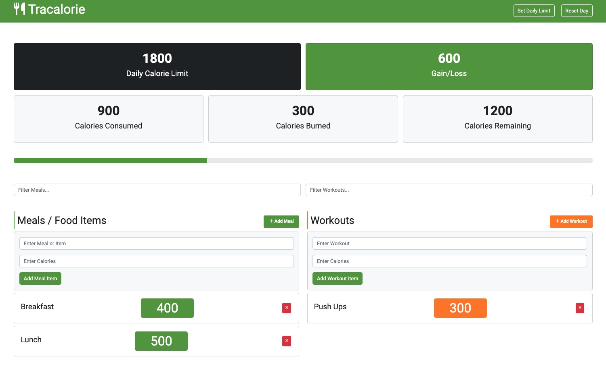

# Tracalorie App

This is a simple calorie counter app built with vanilla JavaScript. It tracks your meals and workouts and calculates the total calories burned and consumed.

This is part of my Modern JavaScript From The Beginning 2.0 course.

All of the code/classes are in the `app.js` file.

There is a version of this app built with Webpack in the `webpack` branch.
